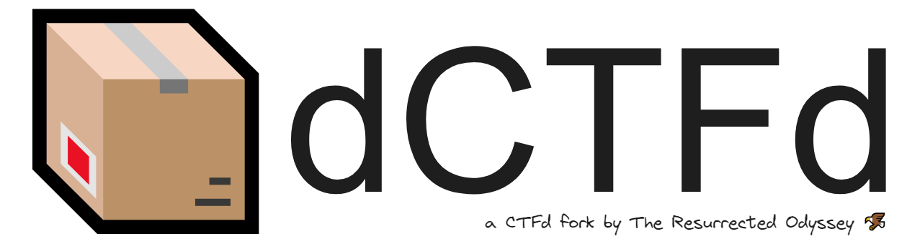

# Information
`dCTFd`™ is a fork of [CTFd 3.5.1](https://github.com/CTFd/CTFd) made for BUET CSE Fest 2023 CTF Competition. It has some added features such as-
- SSL Certificate for Database Connection(s)
- Modified `docker-compose.yml` file for cloud based setup (GCP, DigitalOcean, etc.)
- Modified and custom scripts for testing database and s3 connections

For a more detailed information, read [this blog](https://theresurrectedodyssey.medium.com/creating-a-scalable-ctf-infrastructure-on-digitalocean-90dfe1d38988) entry from us.

# License
[Apache License](./LICENSE)

# Author(s)
- Original CTFd Developers
- [Ataf Fazledin Ahamed](https://github.com/fazledyn)
